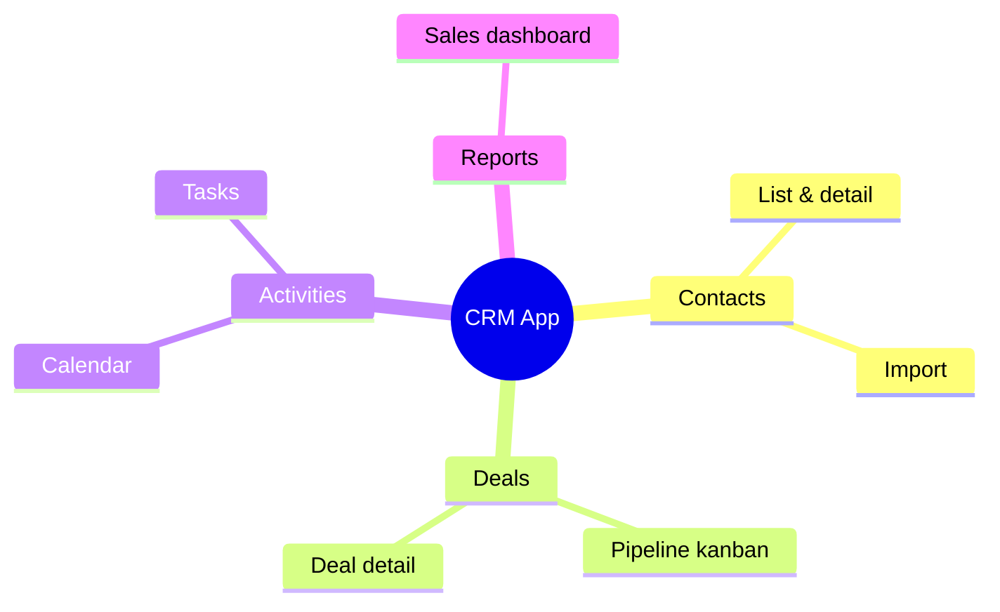
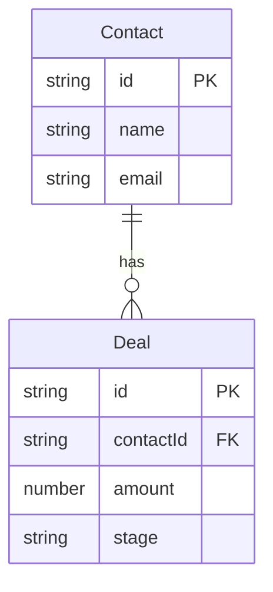

# Docyrus Project Planning

A repo-local planning system (`docyrus project-plan`) that tracks phases, features, and tasks for a Docyrus-backed application. It lives in `docyrus/project-plan/` and renders `PROJECT_PLAN.md` (human view) from `project-plan.json` (source of truth), alongside a `diagrams/` folder of **author-owned Mermaid diagrams**.

Use it to design the application before writing code — **data model first**, then the navigation/layout shell, then real UI content topic by topic, then the cross-cutting backend (dashboards, templates, ACL, automations, AI tools).

For platform capabilities, see the **docyrus-platform** skill. For CLI flags, see the **docyrus-cli-app** skill and [references/command-reference.md](references/command-reference.md).

## Concepts

| Entity | Description |
|--------|-------------|
| **Phase** | A lifecycle stage (e.g. "Data Sources", "Navigation & Layout", a per-topic UI phase). Groups tasks by *when* they are done. Phases are ordered. |
| **Feature** | A coherent unit of functionality (e.g. "Invoices data source", "Deals kanban board"). Spans phases via its tasks. Versioned when redesigned. |
| **Task** | An atomic work item inside a feature. Has a type, assignee (`agent`/`user`), and status. |

**Task types:** `new-implementation`, `bug-fix`, `work`, `api-test`, `browser-automation-test`

**Task statuses:** `planned` → `in_progress` → `done` (or `blocked`)

**Files in `docyrus/project-plan/`:**

| Path | Contents | Owner |
|------|----------|-------|
| `project-plan.json` | Canonical graph (source of truth) | CLI (every write command) |
| `PROJECT_PLAN.md` | Human-readable plan | CLI (every write command) |
| `diagrams/*.mermaid` | Feature mindmap, data-source ER diagram, and any other diagrams | **You** (authored by hand) |

## Step 0 — Draw the diagrams first

**Before** creating phases, features, or tasks, design the project visually. Write Mermaid diagrams into `docyrus/project-plan/diagrams/` as `*.mermaid` files. These are **never auto-generated** — you author them, and the project-plan dashboard automatically lists and renders every `.mermaid` file in the folder. Add as many as the project needs; the user may ask for more than the two defaults.

Run `docyrus project-plan init` first to create the folder, then write the files (with your Write/file tools).

Always create at least these two:

### 1. Feature mindmap — `feature-mindmap.mermaid`

Break the product down into feature areas. This becomes the basis for your features and per-topic UI phases.



### 2. Data source ER diagram — `data-source-er.mermaid`

Model every entity, its key fields, and relations. **Design this before creating any data source** — a wrong field type is expensive to fix once data exists.



### More diagrams as needed

Add whatever helps — a navigation map (`flowchart`), an automation flow (`sequenceDiagram`/`flowchart`), a state diagram for a status field, etc. One diagram per file. Start a file with `%% title: My Title` to control its dashboard title; otherwise the file name is humanized.

Verify what the dashboard will show with `docyrus project-plan list-diagrams`.

## Phase structure

Plan in this order. Earlier phases are prerequisites for later ones. `init` seeds the backbone phases; you insert the topic-by-topic UI phases in the middle (orders 10–89 are left free).

### Phase 1 — Data Sources (always first)

Design and create the entire data model before any UI. Drive this from the ER diagram.

**Tasks per data source:**
- `new-implementation` / `agent` — create the data source + all fields + enum option lists
- `api-test` / `agent` — validate the schema and round-trip a test record

Create parent/independent data sources before dependent ones (relation fields need the parent's data source ID first).

Skill: **docyrus-data-source-design**

### Phase 2 — Navigation & Layout (placeholders only)

Build the **shell** of the app with placeholder content for the right-hand/main content area. The goal is that every page exists and is reachable before any real content is implemented.

Cover:
- **Side navigation** and its **hierarchy** (groups, nested items, ordering).
- **Dashboard slots** in the navigation (real dashboards come later).
- **Per-page inner tabs** where needed — tabs rendered next to the page title row. Two common shapes:
  - tabs for **different data sources**, each tab a data-grid listing of one data source; or
  - tabs **focused on one data source** showing different view types — **list (grid/table)**, **kanban board**, **map view**, **pivot view**, **gallery view**, etc.
- The main and inner navigation **planned and implemented with placeholders** standing in for the real content.

**Tasks:**
- `new-implementation` / `agent` — main layout + side navigation hierarchy with placeholder pages
- `new-implementation` / `agent` — per-page inner tab scaffolding (view-type tabs / multi-data-source tabs) with placeholders

Skills: **docyrus-app-dev-react**, **docyrus-data-grid-page-design**

### Phase 3+ — UI implementation, topic by topic

From the 3rd phase onward, **each phase implements the real content of a group of pages for one topic** (one feature area from the mindmap — e.g. "Contacts", then "Deals", then "Activities"). Replace the placeholders with working pages: grids, detail/edit forms, the view types planned in Phase 2.

Skills: **docyrus-data-grid-page-design**, **docyrus-record-detail-form-design**, **docyrus-data-view-config-design**, **docyrus-app-dev-react**

**Data-view task rule (required):** whenever a data listing page is implemented with **`useDocyrusDataGrid`** or **`useDocyrusDataTable`**, add a task to create that page's **data views** with the `docyrus studio` data-view CRUD commands (`create-data-view`, `update-data-view`, `list-data-views`, …). Data views are the saved column sets, filters, sort, grouping, paging, and color rules the grid/table loads — and they back the view-type tabs (list/kanban/map/pivot/gallery) and any multi-data-source tabs planned in Phase 2. Create the data views before the dummy-data and e2e tasks so the page renders against real views.

- `new-implementation` / `agent` — create the data views for each `useDocyrusDataGrid`/`useDocyrusDataTable` listing page in this phase. Skill: **docyrus-data-view-config-design**

**Every UI implementation phase MUST end with these two tasks (in this order):**

1. `new-implementation` / `agent` — **Generate dummy data** into the data sources used by the pages built in this phase (e.g. via `docyrus ds create` bulk inserts), so the UI can be exercised with realistic content.
2. `browser-automation-test` / `agent` — **E2E browser tests** for the pages built in this phase, using the **docyrus-e2e-browser-testing** skill.

Add one such phase per topic. Keep topics small enough that a phase is releasable on its own.

### Tail phases (after all UI topics)

Run these once the UI is in place. `init` seeds them at high orders so they sort after your topic phases. Skip the ones that aren't meaningful for the project's scope.

| Phase | What it covers | Skill |
|-------|----------------|-------|
| **Dashboards** | Implement the dashboard page(s) and their widgets against real data | docyrus-data-grid-page-design, docyrus-app-dev-react |
| **Templates** | Email templates and Print/PDF (HTML) templates — **only if meaningful** | docyrus-email-template-design, docyrus-print-pdf-template-design |
| **Access Control** | Design the ACL: roles, permissions, and the organization hierarchy | docyrus-acl-design |
| **Automations** | Event-driven and scheduled automations — **only if meaningful** | docyrus-automation-design |
| **AI Tools (Docy)** | App-scoped AI tools for the base AI agent (Docy) | docyrus-app-ai-tools |

## Do NOT plan or implement Workspace Settings pages

The main shell application **already provides** the pages below under **Workspace Settings**. They are built-in — do **not** plan or implement them, **even if the user lists them in the initial requirements**. If a requirement maps to one of these, note that it is already provided and move on.

| Main Page | Sub Pages (already provided) |
|-----------|------------------------------|
| **Regional Settings** | single page — language, timezone, locale, date/number formats, currency, working hours |
| **Account Management** | Your Products · Bills & Payments · Billing Accounts · Payment Methods |
| **Manage Organization** | Users · Teams · Organization Hierarchy (org chart) |
| **Roles & Permissions** | Roles · Query Rules · AI Agents Access |
| **Integrations** | API Connectors · Messaging Connectors · Microsoft Services · Google Services |
| **Automations** | single workspace — build/manage automated workflows & triggers (Studio) |
| **Templates** | Print / PDF Templates · Email Templates · Prompt Templates |
| **Data & Backups** | Data · Import · Export · Backups |
| **Audit Logs** | Data Source Operations · Customization Operations |
| **Usage** | Summary · AI Credits · File Storage · Database Storage · Automation Runs · Integration Calls · AI Document Index Storage |
| **Branding** | single page — tenant brands: visual identity, typography, voice, AI content rules |

> Note: "Templates", "Automations", "Roles & Permissions", and "Organization Hierarchy" appear both here (as built-in *management* surfaces) and in the plan's tail phases. The tail phases are about **authoring the project's own** templates / automations / roles / org hierarchy as part of the app — not rebuilding these settings screens. Never build the settings screens themselves.

## Workflow

### Starting a new project

```bash
docyrus project-plan init
```

Creates the plan graph, the backbone phases, and the empty `diagrams/` folder. Safe to re-run — it prints a notice and exits without changes. After init, **author the diagrams** (Step 0), then add features and per-topic UI phases.

### Adding a feature and its tasks

```bash
# Create the feature
docyrus project-plan upsert-feature \
  --title "Contacts" \
  --summary "Contact list, detail/edit, and import"

# Create tasks (phase IDs from list-phases; feature ID from upsert-feature output)
docyrus project-plan upsert-task \
  --featureId <feature-id> --phaseId <data-sources-phase-id> \
  --title "Create Contact data source with fields and enums" \
  --type new-implementation --assignee agent
```

### Adding a topic UI phase (orders 10–89)

```bash
docyrus project-plan upsert-phase \
  --title "Contacts UI" --slug contacts-ui \
  --summary "Contact list, detail, and import pages" --order 10
# ...feature + UI tasks...
# then the mandatory closing two tasks:
docyrus project-plan upsert-task --featureId <id> --phaseId <contacts-ui> \
  --title "Generate dummy Contacts data" --type new-implementation --assignee agent
docyrus project-plan upsert-task --featureId <id> --phaseId <contacts-ui> \
  --title "E2E browser test Contacts pages" --type browser-automation-test --assignee agent
```

### Tracking progress

```bash
docyrus project-plan list-phases        # phases with progress counts
docyrus project-plan list-features      # features with status and progress
docyrus project-plan list-tasks --status planned --limit 5
docyrus project-plan set-task-status --taskId <id> --status in_progress
docyrus project-plan set-task-status --taskId <id> --status done
```

When the last task in a phase is marked `done`, `set-task-status` returns `completedPhase` — use that as the trigger to run `release-phase`.

### Listing the diagrams

```bash
docyrus project-plan list-diagrams                    # file names + titles
docyrus project-plan list-diagrams --includeContent true
```

The dashboard renders every `.mermaid` file in `docyrus/project-plan/diagrams/`. There is no render/generate command — edit the files directly.

### Opening the project dashboard

```bash
docyrus project-plan open-dashboard            # opens browser (blocks until Ctrl+C)
docyrus project-plan open-dashboard --port 3000
docyrus project-plan open-dashboard --noOpen   # server only; prints the URL
```

The dashboard polls the plan files every 2 seconds and has a **Diagrams** tab that lists and renders all your `.mermaid` files. Pi-agent: use `--noOpen`, capture the URL, and tell the user to open it; run it in a background process.

### Releasing a completed phase

```bash
docyrus project-plan release-phase --phaseId <phase-id> --dryRun
docyrus project-plan release-phase --phaseId <phase-id>            # auto bump
docyrus project-plan release-phase --phaseId <phase-id> --bump minor
```

Changelog is generated from the phase's task titles: `new-implementation` → **Added**, `bug-fix` → **Fixed**, `work` → **Changed**; `api-test`/`browser-automation-test` are skipped. Bump auto-detects: `new-implementation` present → `minor`, else `patch`. It then bumps `package.json`, stamps `project-plan.json`'s `projectVersion`, commits, tags, and creates a GitHub release via `gh`.

### Syncing from planning artifacts

```bash
docyrus project-plan upsert-from-plan --artifactPath .docyrus/plans/<timestamp>-<slug>.md
docyrus project-plan upsert-from-architect --artifactDir .docyrus/plans/<timestamp>-<slug>/
```

## Key Rules

- **Diagrams first.** Author the feature mindmap and data-source ER diagram (plus any others requested) into `docyrus/project-plan/diagrams/` before creating phases/features/tasks. Think the model through visually first.
- **Data sources before anything else.** Phase 1 creates the whole data model. A wrong field type is expensive to fix after data exists. Create parent data sources before dependent ones.
- **Shell before content.** Phase 2 builds the navigation hierarchy, dashboard slots, and per-page inner tabs (view types / multi-data-source tabs) with placeholders — before any real page content.
- **One topic per UI phase, from Phase 3 on.** Implement real page content topic by topic. **Every UI phase ends with exactly two tasks: (1) generate dummy data for that phase's data sources, (2) e2e browser tests via docyrus-e2e-browser-testing.**
- **Data views for every grid/table page.** Any listing page using `useDocyrusDataGrid` or `useDocyrusDataTable` needs a task to create its data views with `docyrus studio` data-view commands — before the dummy-data and e2e tasks.
- **Tail phases last, and only if meaningful.** Dashboards → Templates → Access Control → Automations → AI Tools (Docy). Skip Templates/Automations when out of scope.
- **Never build Workspace Settings pages.** The pages in the exclusion table are provided by the shell — skip them even when requested.
- **Keep `agent` and `user` tasks separate.** `user` tasks require human action (approval, credentials, deploy). Never assign a `user` task to the agent.
- **`release-phase` when a phase is complete.** When `set-task-status` returns `completedPhase`, run `release-phase --phaseId <id>` (use `--dryRun` first).

## Self-validation checklist (run when the plan is finished)

Once you have drafted the full plan, **stop and self-validate** against this checklist before presenting it as done. Walk each item; for anything that fails, fix the plan and re-check. Report the result to the user.

**Diagrams**
- [ ] `docyrus/project-plan/diagrams/` contains a **feature mindmap** and a **data-source ER diagram** (plus any extra diagrams the user requested).
- [ ] Every diagram is a valid `*.mermaid` file; `docyrus project-plan list-diagrams` shows them all with sensible titles.
- [ ] The ER diagram covers every entity referenced by the planned pages.

**Phase order & shape**
- [ ] **Phase 1** creates the entire data model (every data source, fields, enums, relations); parent data sources precede dependent ones.
- [ ] **Phase 2** builds the navigation/layout shell with placeholders: side-nav hierarchy, dashboard slots, and per-page inner tabs (view types / multi-data-source tabs).
- [ ] **Phase 3+** are topic-by-topic UI phases (one feature area each), ordered 10–89, before the tail phases.

**Per UI phase**
- [ ] Each `useDocyrusDataGrid` / `useDocyrusDataTable` listing page has a **create-data-views** task (`docyrus studio` data-view commands).
- [ ] The phase's **last two tasks** are, in order: (1) generate dummy data for that phase's data sources, (2) e2e browser tests (docyrus-e2e-browser-testing).

**Tail phases**
- [ ] Present in order and only where meaningful: Dashboards → Templates → Access Control (roles, permissions, org hierarchy) → Automations → AI Tools (Docy).

**Exclusions & hygiene**
- [ ] No phase, feature, or task builds a **Workspace Settings** page from the exclusion table.
- [ ] `agent` vs `user` assignees are correct — no human-only task assigned to the agent.
- [ ] `docyrus project-plan check` passes (no graph integrity errors) and `list-phases` reflects the intended structure.

## Related Skills

Dispatch these for the actual implementation work in each phase:

| Phase / topic | Skill |
|---------------|-------|
| Data model | **docyrus-data-source-design** — create data source → fields → enums → validate → test |
| List/grid pages, view types, inner tabs | **docyrus-data-grid-page-design**, **docyrus-data-view-config-design** |
| Detail / edit / inline forms | **docyrus-record-detail-form-design** |
| React app, layout, navigation | **docyrus-app-dev-react** |
| Dummy data | **docyrus-cli-app** (`docyrus ds create` bulk), **docyrus-dsql-query-design** |
| E2E browser tests | **docyrus-e2e-browser-testing** |
| Email templates | **docyrus-email-template-design** |
| Print/PDF templates | **docyrus-print-pdf-template-design** |
| ACL: roles, permissions, org hierarchy | **docyrus-acl-design** |
| Automations | **docyrus-automation-design** |
| AI tools for Docy | **docyrus-app-ai-tools** |
| Custom AI agents | **docyrus-agent-design** |
| Platform context | **docyrus-platform** |
| CLI reference | **docyrus-cli-app** |
