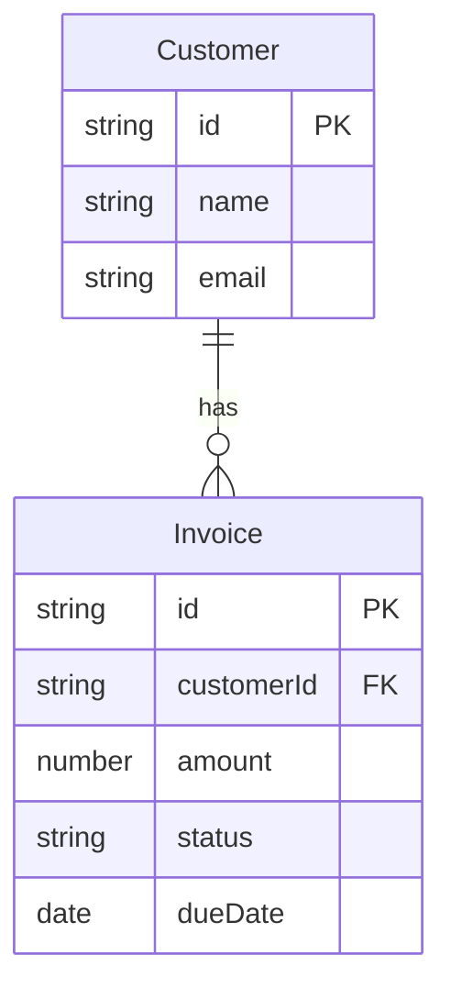

# Docyrus Project Planning

A repo-local planning system (`docyrus project-plan`) that tracks phases, features, and tasks for a Docyrus-backed application. It lives in `.docyrus/project-plan/` and renders to `PROJECT_PLAN.md` and two Mermaid diagram files. Use it to design the backend before writing any code — data model first, then automations, then agents, then templates.

For platform capabilities, see the **docyrus-platform** skill. For CLI flags, see the **docyrus-cli-app** skill.

## Concepts

| Entity | Description |
|--------|-------------|
| **Phase** | A lifecycle stage (e.g. "Data Model", "Automations"). Groups tasks by when they are done, not what they are. |
| **Feature** | A coherent unit of backend functionality (e.g. "Invoice data source", "Payment reminder automation"). Belongs to one or more phases via its tasks. Versioned when redesigned. |
| **Task** | An atomic work item inside a feature. Has a type, assignee (`agent`/`user`), and status. |

**Task types:** `new-implementation`, `bug-fix`, `work`, `api-test`, `browser-automation-test`

**Task statuses:** `planned` → `in_progress` → `done` (or `blocked`)

**Generated files** (all in `.docyrus/project-plan/`):

| File | Contents | Update trigger |
|------|----------|----------------|
| `project-plan.json` | Canonical graph (source of truth) | Every write command |
| `PROJECT_PLAN.md` | Human-readable plan | Every write command |
| `FEATURES.mermaid` | Flowchart of phases → features → progress | `render-diagrams` command |
| `DATA_SOURCES.mermaid` | ER diagram of the data model | `render-diagrams --forceDataSources` (or auto-created on first run) |

## Recommended Phase Structure

Design a Docyrus-backed application in these phases, in order. Later phases depend on earlier ones — don't start automations before the data model is solid.

### Phase 1 — Architecture

Define the data model, feature map, and integration boundaries. No CLI commands yet — produce thinking artifacts.

**Tasks:**
- Draft `DATA_SOURCES.mermaid` (ER diagram) — entity names, key fields, relations
- Draft `FEATURES.mermaid` (feature map) via `render-diagrams`
- List every automation trigger and action chain needed
- List every AI agent needed and its tools/knowledge
- Identify outbound email and PDF/print templates needed
- Identify external connectors and webhooks

Skill: use the `/architect` command if available to produce `data-sources.plan.json` and `PLAN.md` artifacts, then sync with `project-plan upsert-from-architect`.

### Phase 2 — Data Model

Create every data source, field, enum option list, and cross-source relation.

**Tasks per data source:**
- `new-implementation` / `agent` — create data source + all its fields + enums
- `api-test` / `agent` — validate schema and round-trip a test record

Skill: **docyrus-data-source-design**

Order: create parent/independent data sources before dependent ones (you need parent IDs for relation fields).

### Phase 3 — Automations

Build event-driven workflows: record triggers, scheduled jobs, webhooks, button activations, webform submissions.

**Tasks per automation:**
- `new-implementation` / `agent` — create automation + trigger + action nodes
- `api-test` / `agent` — fire the trigger (manually or via a test record) and verify the action chain ran

Skill: **docyrus-automation-design** _(in development)_

Common patterns:
- Record-created trigger → send-email action (onboarding, confirmation)
- Record-modified trigger → update-records action (status propagation)
- Recurrence trigger → ai-agent action (scheduled batch processing)
- Webhook trigger → create-record action (external intake)
- Button-activation trigger → generate-document action (on-demand PDF)

### Phase 4 — AI Agents

Create AI agents, attach tools and data sources, upload knowledge, define workflow steps and recurring tasks.

**Tasks per agent:**
- `new-implementation` / `agent` — create agent with model + system prompt + data sources + tools
- `new-implementation` / `agent` — configure workflow steps and/or recurring tasks if needed
- `api-test` / `agent` — send a test task and verify the response

Skills: **docyrus-agent-design** _(in development)_, **docyrus-app-ai-tools** (author the tools an agent calls)

### Phase 5 — Communication Templates

Design and publish the email and print/PDF templates the automations and agents will render.

**Tasks per template:**
- `new-implementation` / `agent` — design and create the template (email or HTML/PDF)
- `api-test` / `agent` — render the template against a sample record and verify output

Skills: **docyrus-email-template-design** _(in development)_, **docyrus-print-pdf-template-design** _(in development)_

### Phase 6 — UI Components

Define data views, record forms, and public webforms that the frontend will consume.

**Tasks:**
- `new-implementation` / `agent` — create data views (column sets, filters, sorting)
- `new-implementation` / `agent` — create record detail forms
- `new-implementation` / `agent` — create public webforms where needed

Skill: **docyrus-discover-ui-components** _(in development)_

### Phase 7 — Testing & Validation

End-to-end validation of the entire backend before the frontend consumes it.

**Tasks:**
- `api-test` / `agent` — validate every data source schema (re-read + DSQL schema)
- `api-test` / `agent` — exercise every automation with real trigger data
- `api-test` / `agent` — run every agent with representative inputs
- `api-test` / `user` — user acceptance check: record flows, form submissions, email delivery

### Phase 8 — Deployment

Deploy the app and configure production concerns.

**Tasks:**
- `new-implementation` / `user` — deploy app and confirm deployment status
- `new-implementation` / `user` — configure navigation menus
- `work` / `user` — set up localization if needed
- `work` / `user` — review audit log and access-control levels

## Workflow

### Starting a new project

```bash
docyrus project-plan init
```

One command creates the plan graph, all eight standard Docyrus phases, `FEATURES.mermaid`, and `DATA_SOURCES.mermaid` stubs. Safe to call on an already-initialised project — it prints a notice and exits without changing anything.

### Adding a feature and its tasks

```bash
# Create the feature
docyrus project-plan upsert-feature \
  --title "Invoice data source" \
  --summary "Tracks customer invoices with line items and payment status"

# Create tasks (use phase IDs from list-phases; feature ID from upsert-feature output)
docyrus project-plan upsert-task \
  --featureId <feature-id> --phaseId <data-model-phase-id> \
  --title "Create Invoice data source with fields and enums" \
  --type new-implementation --assignee agent

docyrus project-plan upsert-task \
  --featureId <feature-id> --phaseId <testing-phase-id> \
  --title "Validate Invoice schema and test record round-trip" \
  --type api-test --assignee agent
```

### Tracking progress

```bash
docyrus project-plan list-phases        # phase overview with progress counts
docyrus project-plan list-features      # feature overview with status and progress
docyrus project-plan list-tasks --status planned --limit 5   # next planned tasks
docyrus project-plan set-task-status --taskId <id> --status in_progress
docyrus project-plan set-task-status --taskId <id> --status done
```

When the last task in a phase is marked `done`, `set-task-status` detects the transition and includes `completedPhase` in its response. Use that as the trigger to run `release-phase`.

### Opening the project dashboard

The dashboard is a local web page that polls the plan files every 2 seconds and shows phase goals, feature status, task statistics, and a type breakdown.

```bash
# CLI — opens browser automatically (blocks until Ctrl+C)
docyrus project-plan open-dashboard

# Custom port
docyrus project-plan open-dashboard --port 3000

# Server only — no auto-open (use in remote/agent contexts or to get the URL)
docyrus project-plan open-dashboard --noOpen
```

Pi-agent: run the command with `--noOpen` to start the server and capture the printed URL, then instruct the user to open it. The server blocks until Ctrl+C; run it in a separate terminal or as a background process when needed.

### Releasing a completed phase

After all tasks in a phase are `done`:

```bash
# Preview what the release will look like
docyrus project-plan release-phase --phaseId <phase-id> --dryRun

# Create the release (auto-detects bump type from task types)
docyrus project-plan release-phase --phaseId <phase-id>

# Or with an explicit bump
docyrus project-plan release-phase --phaseId <phase-id> --bump minor
```

`release-phase` generates the changelog from the phase's task titles:
- `new-implementation` tasks → **Added**
- `bug-fix` tasks → **Fixed**
- `work` tasks → **Changed**
- `api-test` / `browser-automation-test` tasks → skipped (internal)

Bump type is auto-detected: `new-implementation` present → `minor`; otherwise → `patch`.

The command then bumps the version in `package.json`, updates `project-plan.json`'s `projectVersion`, commits, tags, and creates a GitHub release via `gh`.

### Syncing from planning artifacts

If you used `/plan` or `/architect` during a planning session:

```bash
# Sync a /plan artifact
docyrus project-plan upsert-from-plan --artifactPath .docyrus/plans/<timestamp>-<slug>.md

# Sync an /architect artifact directory
docyrus project-plan upsert-from-architect --artifactDir .docyrus/plans/<timestamp>-<slug>/
```

### Updating diagram files

```bash
# Regenerate FEATURES.mermaid (always safe, fully derived from the plan graph)
docyrus project-plan render-diagrams

# Also regenerate DATA_SOURCES.mermaid (overwrites manual edits)
docyrus project-plan render-diagrams --forceDataSources
```

`DATA_SOURCES.mermaid` is only auto-created on first run. Extend it manually with field definitions and relationships. Run `--forceDataSources` only to reinitialize from scratch.

## CLI Command Reference

Full command surface for `docyrus project-plan`:

| Command | Purpose |
|---------|---------|
| `init` | Initialise a new project plan: creates the graph, all 8 standard phases, and diagram stubs. No-op if already initialised. |
| `ensure` | Internal: guarantee the graph file exists (used by write commands). Prefer `init` for manual setup. |
| `show` | Show full hierarchy (phases + features + tasks with linked todos) |
| `check` | Validate the graph for integrity errors |
| `config` | Show resolved paths (graph, markdown, diagram files) |
| `summary` | Aggregate stats: task counts by status, phase + feature progress |
| `upsert-phase` | Create or update a phase (`--title`, `--slug`, `--summary`, `--order`) |
| `upsert-feature` | Create or update a feature (`--title`, `--summary`, `--version`, `--featureGroupId`, `--order`) |
| `upsert-task` | Create or update a task (`--featureId`, `--phaseId`, `--title`, `--type`, `--assignee`, `--status`, `--acceptanceCriteria`, `--order`) |
| `list-phases` | Slim phase list with per-phase progress (token-efficient) |
| `list-features` | Slim feature list with status and progress |
| `list-tasks` | Filtered task list (`--phaseId`, `--featureId`, `--status`, `--limit`, `--includeSummary`) |
| `find-tasks` | Search tasks by title, summary, type, assignee, status, or exact ID |
| `get-task` | Single task detail with linked local subtodos |
| `set-task-status` | Update task status (`planned` / `in_progress` / `blocked` / `done`); response includes `completedPhase` when a phase just became fully done |
| `release-phase` | Create a semver release from a completed phase's tasks (`--phaseId`, `--bump`, `--version`, `--dryRun`, `--skipTag`, `--skipGithubRelease`) |
| `set-order` | Set display order on a phase, feature, or task |
| `create-linked-todo` | Create a `.pi/todos` subtask linked to a canonical task |
| `upsert-from-plan` | Sync a `/plan` artifact markdown file into the graph |
| `upsert-from-architect` | Sync an `/architect` artifact directory into the graph |
| `render-diagrams` | Write `FEATURES.mermaid` and (if missing) `DATA_SOURCES.mermaid`; `--forceDataSources` to overwrite |
| `open-dashboard` | Start a local HTTP dashboard that polls plan files every 2 s (`--port`, `--noOpen`) |

See [references/command-reference.md](references/command-reference.md) for full flag details and examples.

## Diagram Files

### FEATURES.mermaid

Auto-generated flowchart. Each phase becomes a subgraph; each feature node shows title, version, derived status, and task progress. Regenerated every time `render-diagrams` runs. Do not edit manually — changes will be overwritten.

### DATA_SOURCES.mermaid

ER diagram stub. Auto-populated from `newDataSources` entries found in `/architect` artifacts (`.docyrus/plans/*/data-sources.plan.json`). Falls back to a commented skeleton when no artifacts exist. **Edit manually** to add field definitions and relationships — the file is preserved across `render-diagrams` runs unless `--forceDataSources` is passed.

Example of a hand-extended `DATA_SOURCES.mermaid`:



## Key Rules

- **Architecture before implementation.** Design `DATA_SOURCES.mermaid` before creating any data source in Docyrus. A wrong field type is expensive to fix after data exists.
- **Create parent data sources first.** Relation fields reference a parent's data source ID — the parent must exist before the child.
- **One feature = one coherent backend unit.** A feature can span phases (design task in Architecture, create task in Data Model, test task in Testing). Use `featureGroupId` to link versions of the same feature.
- **Keep `agent` and `user` tasks separate.** `agent` tasks are automated; `user` tasks require human action (approval, manual credential setup, physical delivery). Never assign a `user` task to the agent.
- **`render-diagrams` after major plan changes.** Keep `FEATURES.mermaid` current so it reflects actual progress. Update `DATA_SOURCES.mermaid` manually as the schema evolves.
- **Validate every data source before moving to automations.** Automations reference field slugs — a missing or misspelled slug will silently fail at runtime.
- **`release-phase` when a phase is complete.** When `set-task-status` returns `completedPhase`, run `release-phase --phaseId <id>` to stamp a semver release. Use `--dryRun` to preview before committing.

## Related Skills

Dispatch these skills when doing the actual implementation work for each phase:

| Phase | Skill |
|-------|-------|
| Data Model | **docyrus-data-source-design** — full workflow: create data source → add fields → add enums → validate → test |
| Automations | **docyrus-automation-design** _(in development)_ — create automation, trigger, and action nodes |
| AI Agents | **docyrus-agent-design** _(in development)_ — create agent, bind tools and data sources, configure workflow steps |
| Agent Tools | **docyrus-app-ai-tools** — author AI tools an app/agent can call (`apps ai-tools`); attach to an agent with `agent tools` |
| Email Templates | **docyrus-email-template-design** _(in development)_ — design and publish email templates |
| PDF/Print Templates | **docyrus-print-pdf-template-design** _(in development)_ — design and publish HTML/PDF/DOCX report templates |
| UI Components | **docyrus-discover-ui-components** _(in development)_ — discover and configure data views, forms, webforms |
| Platform Context | **docyrus-platform** — full platform capability reference |
| CLI Reference | **docyrus-cli-app** — complete CLI flag and command reference |
